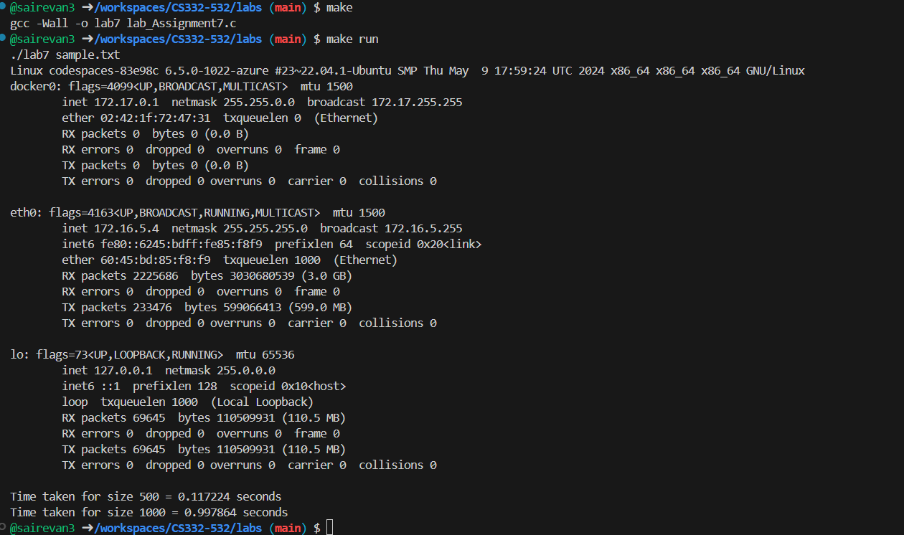
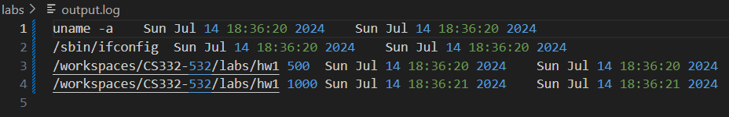

# Lab Assignment-7

This program reads commands from an input file, executes them, and logs the execution times to an output file named `output.log`. It uses `fork` and `exec` to create child processes for command execution.

# Functions

**gettime** : This function is used in hw1 to get the current time.

**execute_commands** : This function reads the input file line by line and creates child process to execute the commands and calls the function log_execution when the child process terminates normally.

**log_execution** : This function writes the output to output.log

**main function** : Take the sample.txt file as input argument and calls the function execute_commands.

# Compilation
**To compile** : use the make file to compile the program. Type make

**To Run** : Type make run.

# output

